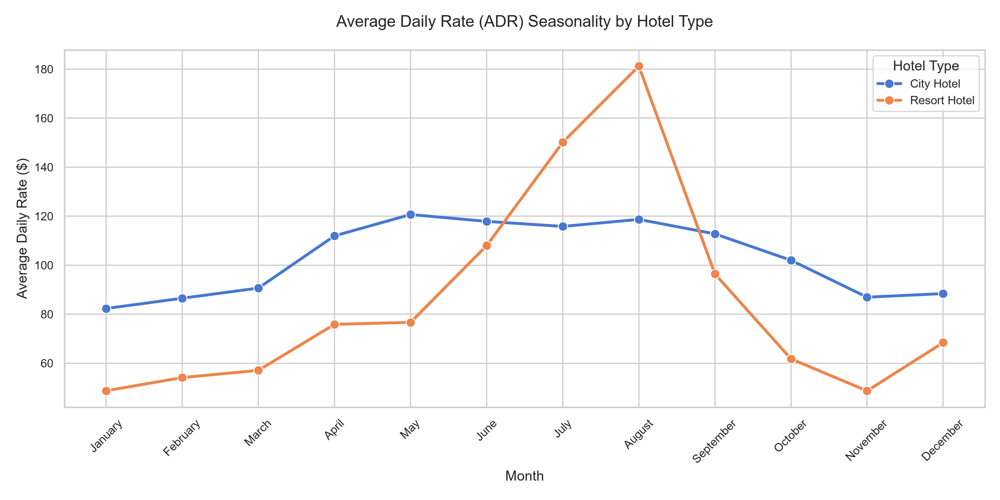
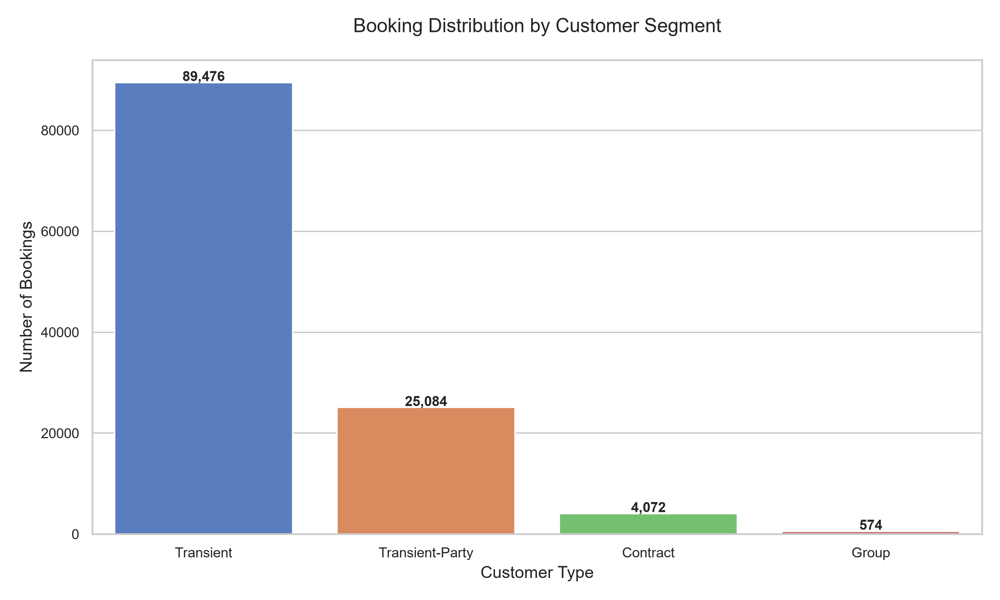
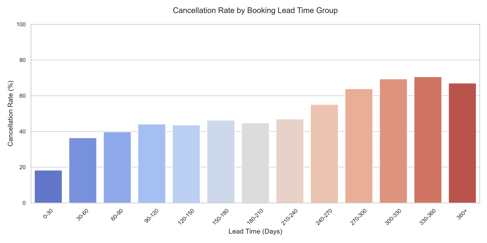
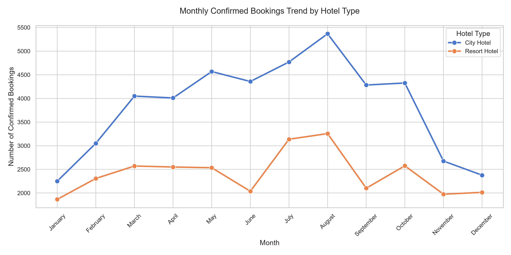
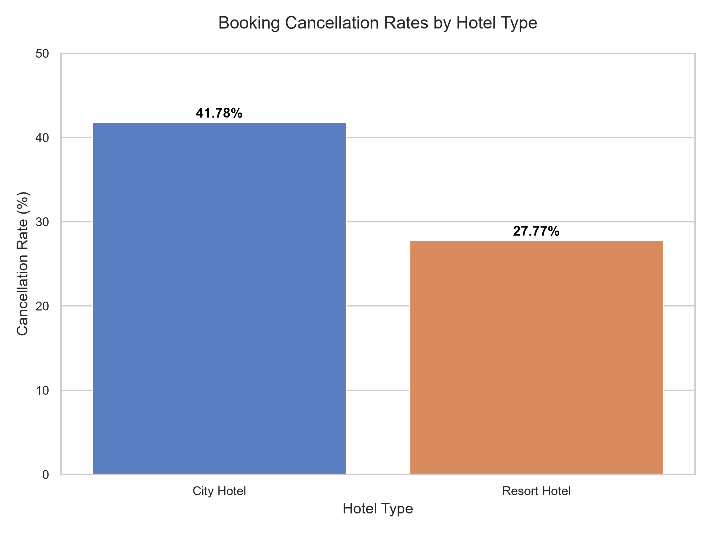
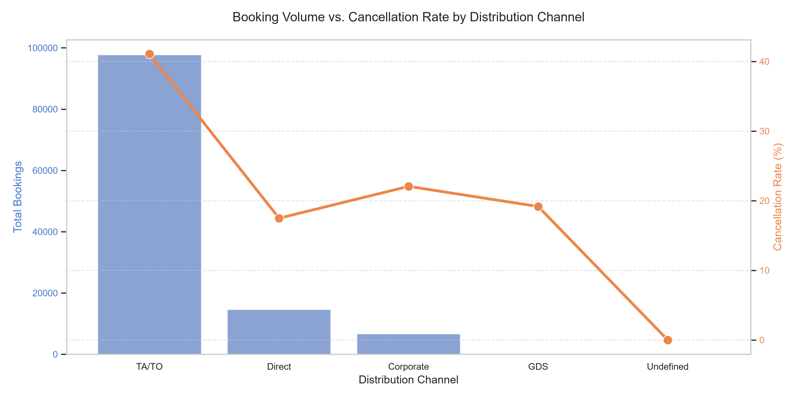
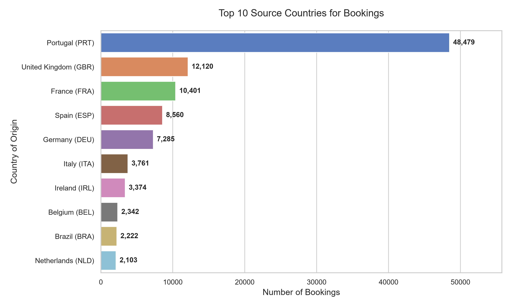
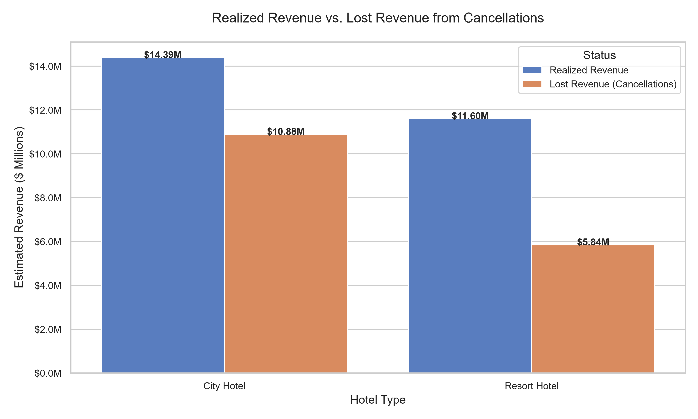

# Hospitality Revenue & Booking Behavior Analysis

An exploratory data analysis of 119,390 hotel bookings using Python to identify 
cancellation drivers, revenue leakage, and demand patterns across city and resort hotels.

## Business Problem

Hotel cancellations directly impact revenue, staffing, and room allocation efficiency. 
This analysis identifies which customer segments, booking channels, and lead time 
patterns drive the highest cancellation rates — and quantifies the revenue lost as a result.

## Key Findings

- **City hotels** have a significantly higher cancellation rate than resort hotels
- Bookings made **300+ days in advance** cancel at ~70% rate vs only 18% for 0-30 day bookings
- **Transient customers** dominate bookings (89,476 out of 119,390) but carry the 
highest cancellation risk
- **Resort hotels** peak at ~$181 ADR in August but drop to ~$52 in November — 
heavy seasonal dependency
- **Direct bookings** show lower cancellation rates than OTA (Online Travel Agency) channels
- Significant revenue is lost annually to cancellations, concentrated in city hotels

## Recommendations

1. **Implement non-refundable deposit policy** for bookings made more than 90 days 
in advance — cancellation risk rises sharply beyond this threshold
2. **Dynamic pricing strategy** for resort hotels during off-peak months (Nov-Feb) 
to reduce ADR volatility
3. **Incentivize direct bookings** over OTA channels through loyalty perks — 
direct bookings show better retention
4. **Overbooking strategy** calibrated by lead time band to offset predictable 
cancellation patterns

## Tools & Technologies

- **Python** — pandas, matplotlib, seaborn
- **Jupyter Notebook** — analysis and visualization
- **Dataset** — Hotel Booking Demand (119,390 records, 2015–2017)

## Repository Contents

| File | Description |
|---|-----|
| `hotel_booking_eda.ipynb` | Full executed notebook with all analysis and outputs |
| `hotel_bookings.csv` | Raw dataset (119,390 rows) |
| `build_notebook.py` | Script used to programmatically build and execute the notebook |
| `*.png` | Exported high-resolution chart visualizations |

## Visualizations

### ADR Seasonality by Hotel Type

### Booking Distribution by Customer Segment

### Cancellation Rate by Lead Time

### Monthly Booking Trends

### Cancellation Rate by Hotel Type

### Distribution Channel Analysis

### Top Countries by Bookings

### Revenue Loss Estimate

